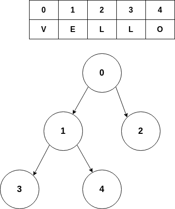

# The Task:

Your mission is to write a NodeJS program with following specs:

1) Fetch data containing a key and nodes from our server
2) Build a binary tree from nodes
3) Traverse the tree and find encoded phrase
4) Send your response back to the server
5) Share your code solution with us

## 1) Fetch data containing a key and nodes from our server

When your program starts, it should fetch fresh data from our server.

Example request:

```
GET https://damp-reef-75685.herokuapp.com/task

200 OK
{
  "key": "abcd",
  "nodes": [
    {
      "id": "id-1",
      "parent": "id-2",
      "weight": 53,
      "value": 2
    },
    {
      "id": "id-3",
      "parent": "id-2",
      "weight": 40,
      "value": 4
    }
    {
      "id": "id-2",
      "parent": "",
      "weight": 29,
      "value": 1
    }
  ]
}
```

## 2) Build a binary tree from nodes

Assumptions:
- The root of the tree has empty string as parent
- Every node can have left and right child
- Left child has even integer `weight`
- Right child has odd integer `weight`
- Calculation should NOT take more than a minutes


## 3) Traverse the tree and find encoded phrase
To find the encoded phrase you need to traverse the tree left to right for
each level starting from the root.  
The node's `value` is index of a character from the `key`.



Your result should look something like this:

```
{
  "answer": "vello",
}
```

## 4) Send your response back to the server

When your program is done, send the result back to our server.

Example request:

```
POST https://damp-reef-75685.herokuapp.com/task
{
  "answer": "vello"
}
```

Example response:

```
200 OK
```


## 5) Share your code solution with us

Document and share your solution and code from Github, using email, FAX. Style is free.

If you have any questions please contact Vello Team:

Eyno  
eyno@vello.fi

Good Luck! We will be more than happy to talk about your solution.
